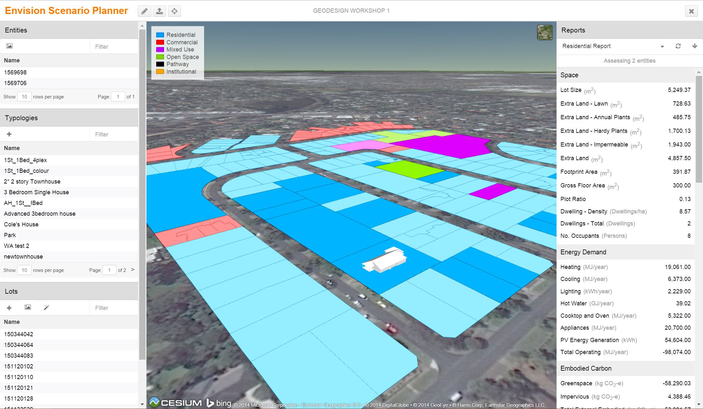

# ENVISION Scenario Planner (ESP)

**ESP** is a geospatial Web application for *sustainable urban planning*.

For more information, visit the homepage of the [CRCSI "Greening the Greyfields"][gtg] project.

**[Access the tool here][host]**. Note that you will need to be provided with a user account by an
*AURIN administrator. To request access, [send us an email][admin-email].

## Getting Started

Read about the [Features](features.md) of the ESP app, or jump right into the
[Walkthrough](walkthrough.md) to learn how to use them.

## Contact

The ESP application is developed by [Urbanetic][urbanetic] as the user interface component of
the [CRCSI "Greening the Greyfields"][gtg] project led by the [CRCSI][crcsi] and supported by the
[Australian Urban Research Infrastructure Network][aurin] (AURIN).

Any questions or comments about the application can be directed to the development team at
[hello@urbanetic.net](mail). Problems or feature requests can be submitted to the application's
[source code repository on GitHub][github].

[host]: http://esp.urbanetic.net/
[admin-email]: mailto:support@urbanetic.net
[aurin]: http://aurin.org.au/
[urbanetic]: http://urbanetic.net/
[crcsi]: http://www.crcsi.com.au/
[gtg]: http://www.crcsi.com.au/research/4-5-urban-planning/4-51-greening-the-greyfields/
[mail]: mailto:hello@urbanetic.net
[github]: https://github.com/urbanetic/aurin-esp
