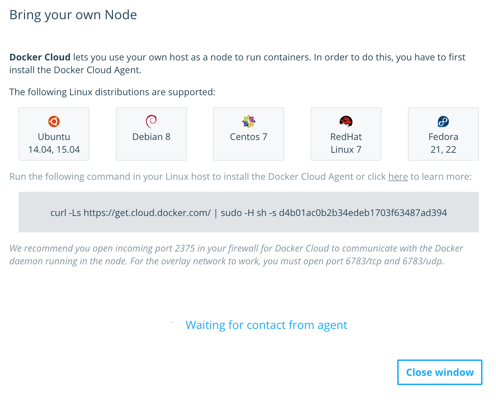
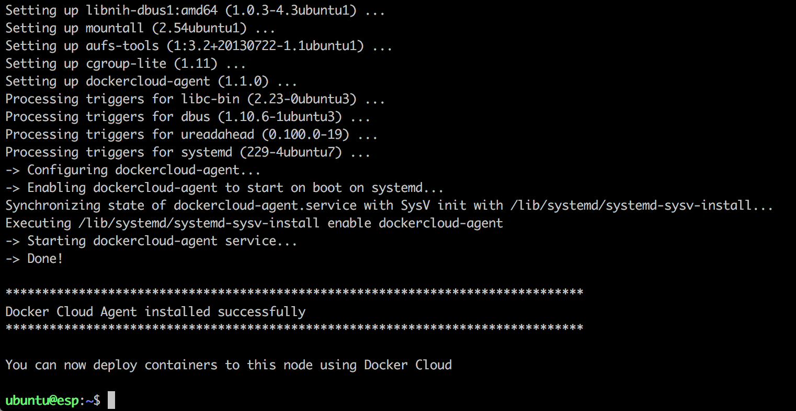
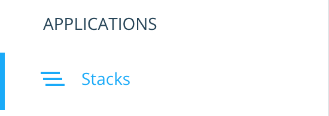
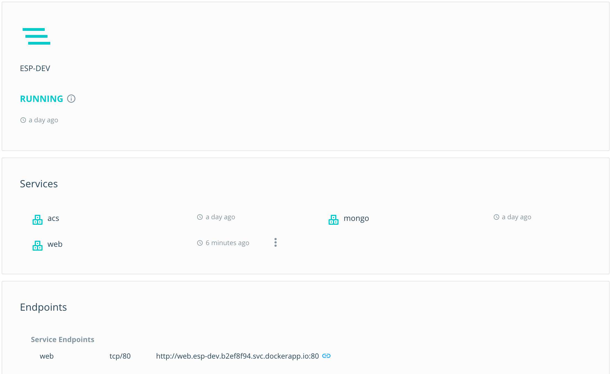
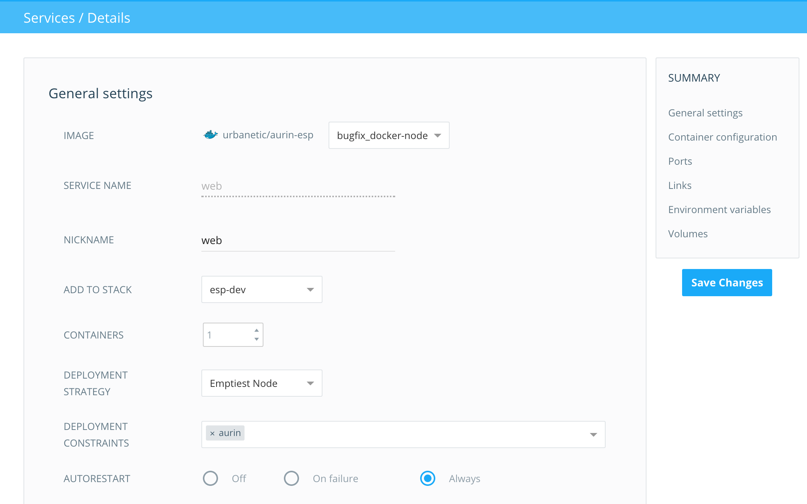

# Docker Cloud Development and Deployment Guide

This guide is a walkthrough of how to develop and deploy ESP, specifically using Docker and Docker
Cloud.

## Setup

To do any local development or builds, you'll need to start by cloning the Git repository:

    git clone git@github.com:AURIN/esp.git --recurse-submodules

Building the source code locally requires a few Node.js-based tools. Assuming you have Node.js and
npm installed, run:

    npm install -g grunt-cli bower

To build, run and push Docker images, you'll need to install Docker. Docker is native to Linux, but
[Docker for Mac][dm] and [Docker for Windows][dw] exist for other platforms.

ESP can store uploaded files on the host or on AWS S3. If you want to use S3, you will need an AWS
account with your access key ID and secret access key handy. Create a bucket for ESP files, and
remember the name and region.

## Develop

Let's say you want to develop a new feature or fix a bug in the code.

Open the project in your preferred IDE (e.g. WebStorm, Atom or Sublime Text). Make sure everything
is where you expect it to be.

We'll start by running the Meteor app locally in development mode to make sure it's working before
changing the code. From the root of the repository directory, run:

    grunt meteor

This will set a few environment variables and run `meteor` in the `/app` directory. Once it's
finished open [`http://localhost:3000`](http://localhost:3000) in your browser and check that the
app is working.

Once you're satisfied, return to your IDE, make some changes to the code and save them to disk. If
the local Meteor server is still running, your browser should refresh automatically to reflect the
new changes (unless new errors were introduced).

Once the changes are made and you've tested that they work, commit them to the repository.

## Build

To build the docker image locally, simply run from the root of the repository:

    npm run buildDocker

This will build the Meteor app into a bundled Node.js app, then package that into a Docker image.
Once it has finished, you can see that it has been created by running:

    docker images

ESP's image will be named something like `urbanetic/aurin-esp:develop`.

Note that ESP is configured for basic continuous integration (CI): every commit that is pushed to
GitHub will trigger a Docker build on [Travis][travis]. If the build succeeds, it will be tagged and
pushed to Docker Hub automatically.

To build ESP's documentation, install [mkdocs][mkdocs] then run:

    npm run docs

## Deploy

Using Docker Cloud, deploying ESP with all dependent systems is just a matter of clicking around a
GUI.

1. Log into [Docker Cloud][dcloud].
1. Connect one or more nodes to a cluster. To bring your own node (e.g. a NeCTAR instance), click
   the "Bring your own node" button and run the provided command on your host.
1. Create a new Stack, and copy in the `Stackfile` from the repository, replacing the passwords and
   secret keys as necessary.
1. In the stack's Actions menu, click Start. The UI will update as the services are started
1. Click on the `web` service and browse to its **Service Endpoint** on port 80. After the
   application has finished starting up, you should see the ESP app in the browser.
1. Log into ESP using your AURIN Auth credentials, and [follow the user guide to get started][ug].

Below are some screenshots of this process.

Bring your own node dialog

Running the Docker Cloud daemon command on host

BYON contacting agent

BYON connected

Application Stacks button

The ESP stack created from the Stackfile

The ESP service created by the stack

## Extensions

**Deployment Constraints**: To control which nodes a service can be deployed on, edit the Service
and add a Deployment Constraint. This is particularly helpful for BYON (i.e. not automated cluster)
configurations where you want to keep related containers together, or keep them off particular nodes.

**Meteor monitoring**: Kadira is a service that provides detailed monitoring of Meteor apps, with a
free tier to try it out. Visit the [Kadira website][kadira] to sign up, then create a "project" and
enter the app ID and app secret in your `Stackfile` to connect to it.

**Centralised logging**: [Papertrail][pt] is a centralised log management service, which allows you
to search and tail logs from all your services from a single page. It also has a free tier to try
out. After signing up, you will receive a unique Papertrail URL. To automatically redirect all logs
to Papertrail, manually create a new Service in Docker Cloud with the following settings:

 * Image: `gliderlabs/logspout:lastest`
 * Deployment Strategy: Every Node
 * Autorestart: Always
 * Entrypoint: `/bin/logspout`
 * Run Command: `syslog://logs4.papertrailapp.com:16441`
 * Privileged: On
 * Volumes:
   * Container path: `/tmp/docker.sock`
   * Host path: `/var/run/docker.sock`
   * Writable

Save and run the service, and a Logspout container will be deployed on every node with access to the
Docker daemon, allowing it to tail and forward system logs for all other Docker containers.

[dcloud]: https://cloud.docker.com
[dm]: https://docs.docker.com/docker-for-mac/
[dw]: https://docs.docker.com/docker-for-windows/
[mkdocs]: http://www.mkdocs.org/
[travis]: https://travis-ci.org/
[kadira]: https://kadira.io/
[pt]: https://papertrailapp.com/
[ug]: http://docs.aurin.org.au/envision-scenario-planner/
